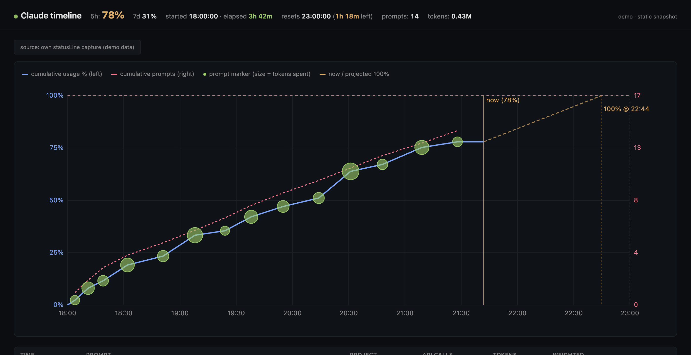

# blaze-claude-plugins

A [Claude Code](https://www.anthropic.com/claude-code) plugin marketplace by [BlazeMV](https://github.com/BlazeMV).

## Install the marketplace

In Claude Code:

```
/plugin marketplace add BlazeMV/blaze-claude-plugins
```

Then install any plugin from the list below:

```
/plugin install <plugin-name>@blaze-claude-plugins
```

Restart Claude Code (or `/reload-plugins`) after installing.

## Plugins

### [claude-timeline](./plugins/claude-timeline)

Live web dashboard of your Claude Code 5-hour session usage and per-prompt cost. Pinned to Anthropic's actual rate-limit headers — see exactly which prompt is eating your budget, in real time.



- **Real-time chart** of cumulative usage % and prompt count over the 5h window
- **Per-prompt cost ranking** in a sortable table
- **Projected exhaustion time** at current burn rate
- **Plays nicely** with [`leeguooooo/claude-code-usage-bar`](https://github.com/leeguooooo/claude-code-usage-bar) — chains through any existing statusLine command transparently
- **Local-only** — no network calls, loopback web server, no data leaves your machine

```
/plugin install claude-timeline@blaze-claude-plugins
```

→ Full docs: [`plugins/claude-timeline/README.md`](./plugins/claude-timeline/README.md)

## Contributing / feedback

Bug reports, ideas, and PRs welcome at [github.com/BlazeMV/blaze-claude-plugins/issues](https://github.com/BlazeMV/blaze-claude-plugins/issues).

## License

MIT — see [LICENSE](./LICENSE).
