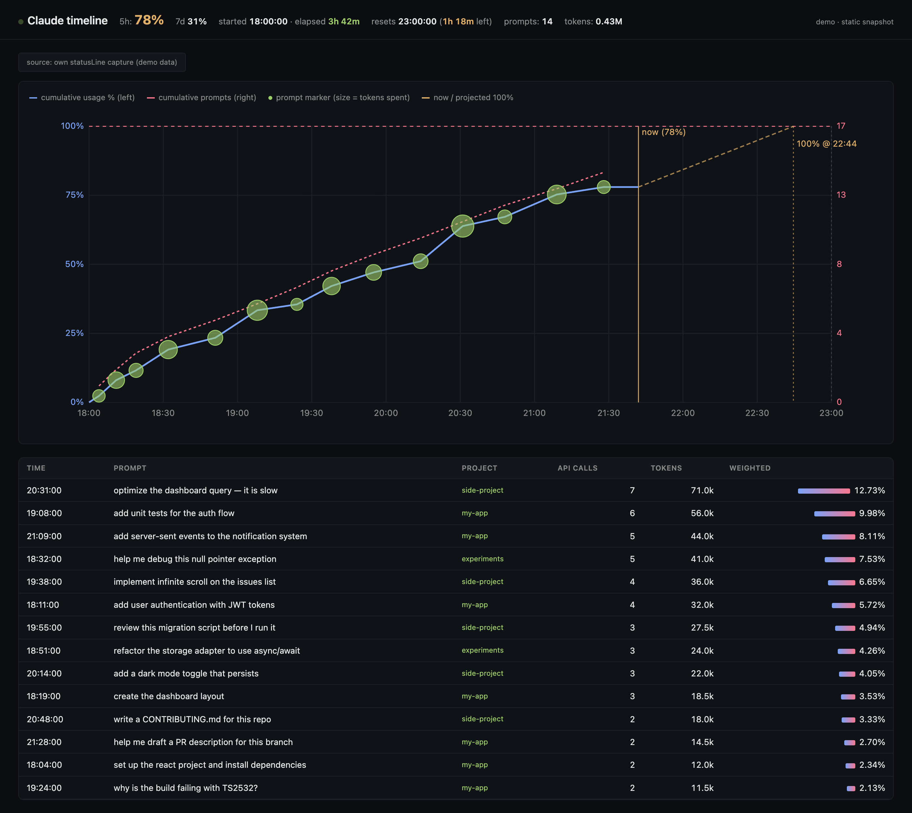

# claude-timeline

Live web dashboard of your Claude Code 5-hour session usage and per-prompt cost. See exactly which prompt is eating your rate-limit budget, in real time.


<sub>↑ Demo data. The dashboard updates live every 2 seconds via Server-Sent Events.</sub>

## Full view

The page below the chart lists every prompt in the current session, sortable by time, cost, or token count — click any column header to re-sort.



## What it shows

- **Cumulative usage %** over your 5-hour rolling window — pinned to Anthropic's actual rate-limit number, not estimated
- **Cumulative prompts** alongside, so you can spot expensive prompts at a glance (steep usage rise + flat prompt line = costly turn)
- **Per-prompt markers** sized by tokens spent; hover for the prompt text and its share of your limit
- **Projected exhaustion time** at your current burn rate
- **Sortable table** of every prompt in the current session, ranked by weighted cost
- **7-day rolling usage %** in the header (when statusLine data is available)

The page subscribes to a Server-Sent Events stream and updates every 2 seconds by default (configurable). Leave the tab pinned and watch usage tick up as you prompt.

## Requirements

- Claude Code (any recent version that supports plugins and `statusLine` stdin payload — tested on v2.1.139)
- Node.js 18+ (uses `for await` over stdin, native `http`, `fs/promises`)
- macOS or Linux (uses `~/.cache` and `~/.claude` paths; should work on WSL)

## Install

```
/plugin marketplace add BlazeMV/blaze-claude-plugins
/plugin install claude-timeline@blaze-claude-plugins
```

Restart Claude Code. Then:

```
/timeline
```

That's it — server starts, browser opens, dashboard renders. You can use it without any further setup; see [Data sources](#data-sources) for what each install state gives you.

## Commands

| Command | What it does |
|---------|--------------|
| `/timeline` | Start the local server (default port `7373`) and open the dashboard. Idempotent — re-running just reopens the tab. |
| `/timeline-stop` | Stop the server. |
| `/timeline-setup` | Install the statusLine wrapper so the plugin captures rate-limit data first-party. Detects any existing statusLine command and chains through it. |
| `/timeline-setup uninstall` | Remove the wrapper, restore your original `statusLine` command. |

## How the data flows

Claude Code pipes a JSON payload to whatever you configure as your `statusLine` command via stdin, and that payload includes the authoritative rate-limit numbers from Anthropic's API response headers:

```json
{
  "rate_limits": {
    "five_hour": { "used_percentage": 83, "resets_at": 1778611200 },
    "seven_day": { "used_percentage":  8, "resets_at": 1779123600 }
  },
  "session_id": "…", "transcript_path": "…", "model": {…}, "cost": {…}
}
```

This plugin ships a tiny statusLine **wrapper** (`scripts/capture.mjs`) that:

```
                  ┌─→ writes ~/.cache/claude-timeline/last_stdin.json  ← our server reads this
Claude Code ─stdin─→ wrapper ─┤
                  └─→ pipes stdin to your existing statusLine (e.g. `cs render`)
                                                          ─→ stdout = visible status bar
```

So:
1. We capture rate-limit data first-party (no dependency on other tools)
2. Your previous statusLine (if any) keeps working transparently — both tools end up with their own independent cache, fed by one entry point

If you don't run `/timeline-setup`, the plugin falls back to other data sources automatically (see below).

## Data sources

Set via `source` in config. Resolution order:

| `source` | Behavior |
|----------|----------|
| `"auto"` *(default)* | Try our own cache first → fall back to [claude-statusbar](https://github.com/leeguooooo/claude-code-usage-bar) cache → fall back to heuristic. |
| `"self"` | Only use our own cache. Requires `/timeline-setup`. Most accurate. |
| `"statusbar"` | Read claude-statusbar's cache at `~/.cache/claude-statusbar/sessions/*/last_stdin.json`. No install needed if you already have claude-statusbar running. |

**Heuristic fallback** (no statusLine data anywhere): the plugin walks `~/.claude/projects/*.jsonl` for prompts in the last 24h, detects the current session by finding gaps >5h between prompts, and shows usage in **raw weighted tokens (M)** instead of %. You lose the exact reset time, the 100% projection line, and a few accuracy points — but everything else (prompt list, cost ranking, chart) still works.

**Stale-cache handling:** if the cache file's `resets_at` is in the past, it's discarded (means it's from a previous 5h window). For the statusbar fallback path, candidates are ranked by `resets_at` first (newest window wins), then mtime.

## Config (`~/.claude/claude-timeline.json`)

Auto-created with defaults on first server start:

```json
{
  "port": 7373,
  "source": "auto",
  "downstream_statusline": null,
  "refresh_ms": 2000
}
```

| Key | Default | Description |
|-----|---------|-------------|
| `port` | `7373` | Port for the local web server. Loopback only (`127.0.0.1`). |
| `source` | `"auto"` | Where to read rate-limit data. See [Data sources](#data-sources). |
| `downstream_statusline` | `null` | A statusLine command to chain through after capturing. Auto-populated by `/timeline-setup` when an existing statusLine is detected. Set manually if you want to pipe to a custom renderer. If `null`, the wrapper captures silently and the visible status bar is blank. |
| `refresh_ms` | `2000` | Server snapshot recompute + SSE push interval. The browser only re-renders when data actually changes — lower values just shorten the lag, they don't churn the UI. |

Restart the server (`/timeline-stop && /timeline`) after editing.

## Compatibility with claude-statusbar

If you use [leeguooooo/claude-code-usage-bar](https://github.com/leeguooooo/claude-code-usage-bar):

- **Before `/timeline-setup`:** zero coupling — we read its cache as a fallback.
- **After `/timeline-setup`:** the setup script detects `cs render` (or whatever you have) and saves it as `downstream_statusline`. Our wrapper captures the stdin, then pipes it to `cs render`. Both tools keep their own cache. The visible status bar in your terminal continues to work exactly as before.
- **To revert:** `/timeline-setup uninstall` puts your original `statusLine.command` back.

## Privacy

Everything is local. Nothing is sent to any external service. Specifically:

- The web server binds to `127.0.0.1` only (not exposed to your network)
- Prompt text, project paths, and token counts all stay in `~/.cache/claude-timeline/` and `~/.claude/projects/`
- The plugin makes no outbound network calls

## Files & locations

| Path | What |
|------|------|
| `~/.claude/plugins/cache/blaze-claude-plugins/claude-timeline/<version>/` | Installed plugin code (Claude Code manages this) |
| `~/.claude/claude-timeline.json` | Config |
| `~/.claude/settings.json` | Modified by `/timeline-setup` (`statusLine.command` key only) |
| `~/.cache/claude-timeline/last_stdin.json` | Captured rate-limit payload |
| `~/.cache/claude-timeline/server.pid` | PID of the running server (cleaned up on stop) |
| `~/.cache/claude-timeline/server.log` | Server stdout/stderr |

## Troubleshooting

**Dashboard shows "no data" / "heuristic" source.**
You haven't run `/timeline-setup` and claude-statusbar isn't installed either. Either run `/timeline-setup` (recommended) or install claude-statusbar. The plugin still works in heuristic mode — just less precise.

**Wrong session window / numbers flicker between two sets of values.**
Probably had multiple Claude Code windows open with stale per-session caches. The plugin filters out caches whose `resets_at` is in the past, but if you see this on the latest version, file an issue. Workaround: run `/timeline-setup` to switch to first-party capture (a single source of truth).

**Server won't start / port in use.**
Change `port` in `~/.claude/claude-timeline.json` and restart, or kill whatever's holding `7373` (`lsof -i :7373`).

**`/timeline` says "already running" but no browser tab opens.**
Open `http://localhost:7373` manually. macOS `open` sometimes silently no-ops if your default browser is in a weird state.

**Visible status bar disappeared after `/timeline-setup`.**
That means no `downstream_statusline` was detected (or you didn't have one before). Set it manually in `~/.claude/claude-timeline.json` to whatever renderer you want, e.g. `"downstream_statusline": "cs render"`.

**View logs.**
```
tail -f ~/.cache/claude-timeline/server.log
```

## Uninstall

```
/timeline-setup uninstall          # restore original statusLine
/timeline-stop                     # kill server
/plugin uninstall claude-timeline@blaze-claude-plugins
rm -rf ~/.cache/claude-timeline ~/.claude/claude-timeline.json
```

## Development

Clone the marketplace repo and install from a local path:

```
git clone https://github.com/BlazeMV/blaze-claude-plugins
cd blaze-claude-plugins
/plugin marketplace add $(pwd)
/plugin install claude-timeline@blaze-claude-plugins
```

When installed from a local path, Claude Code points `CLAUDE_PLUGIN_ROOT` at your working tree, so edits show up live:

| What you change | Live? |
|-----------------|-------|
| `web/index.html` | ✅ Server re-reads on every request |
| `scripts/capture.mjs` | ✅ Re-executed on each statusLine tick (~1s) |
| `scripts/server.mjs`, `analyze.mjs`, `config.mjs` | ❌ Restart server (`/timeline-stop && /timeline`) |
| `commands/*.md` | ⚠️ `/reload-plugins` or restart Claude Code |
| `.claude-plugin/plugin.json` | ❌ `/plugin uninstall && /plugin install` |

Bump `version` in `plugin.json`, tag a release, and push to GitHub for users to update via `/plugin update`.

## License

MIT — see [LICENSE](../../LICENSE).
